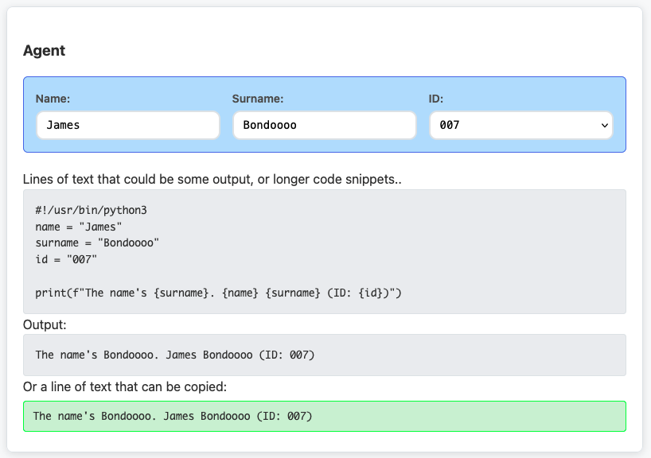

# Command Guide Amplified

A lightweight, reusable widget for creating interactive templates with variable substitution and copy functionality.

## Installation

### NPM
```bash
npm install command-guide-amplified
```

### CDN
```html
<script src="https://unpkg.com/command-guide-amplified/dist/command-guide-amplified.min.js"></script>
```

### Manual
Download the latest release and include the script:
```html
<script src="command-guide-amplified.js"></script>
```


## Example Usage

### 1. Include the script
```html
<script src="command-guide-amplified.js"></script>
```

### 2. Create your HTML structure
```html
<div class="cga-widget" id="my-guide">
    
    <!-- Add your variables -->
    <div class="cga-variable">
        <label>Name:</label>
        <input type="text" class="cga-var-NAME" value="James">
    </div>
    <div class="cga-variable">
        <label>Surname:</label>
        <input type="text" class="cga-var-SURNAME" value="Bond">
    </div>

    ...
    <!-- Add your commands or text with placeholders -->
    A single line of text that can be copied:
    <div class="cga-command">The name's {SURNAME}. {NAME} {SURNAME}.</div>

    Lines of text that could be some output, or longer code snippets..
    <div class="cga-text">
        #!/usr/bin/python3
        name = "{NAME}"
        surname = "{SURNAME}"

        print(f"The name's {surname}. {name} {surname}")
    </div>

    Output:
    <div class="cga-text">The name's {SURNAME}. {NAME} {SURNAME}</div>

</div>
```

### 3. Initialize the widget
```javascript
<script>
    document.addEventListener('DOMContentLoaded', function() {
        console.log('DOM loaded, initializing widgets...');
        
        // Initialize widgets
        const widget = CommandGuideAmplifiedWidget.init('my-guide');
        
    });
</script>
```

Sections automatically initialize if they contain data-cga-widget attribute:
```html
<div class="cga-widget" data-cga-widget>
    ...
</div>
```

### 4. Result
